# DSY---project

## How to run app Dev mode

1. Download and install latest `Msys2` [link](https://repo.msys2.org/distrib/x86_64/)
2. Download `LTS Nodejs` prebuilt binaries [link](https://nodejs.org/en/download/prebuilt-binaries)
3. Extract all files and add folder path containing `node.exe` file to `%PATH%`
4. Download and install latest version of `Insomnia` [link](https://insomnia.rest/download)
5. Go to your `settings` on [Github](https://github.com/)
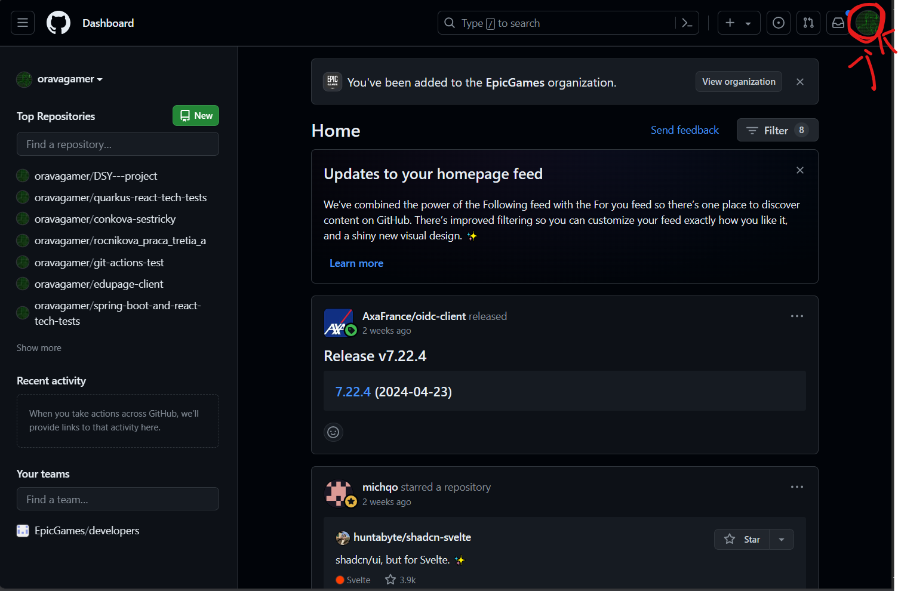
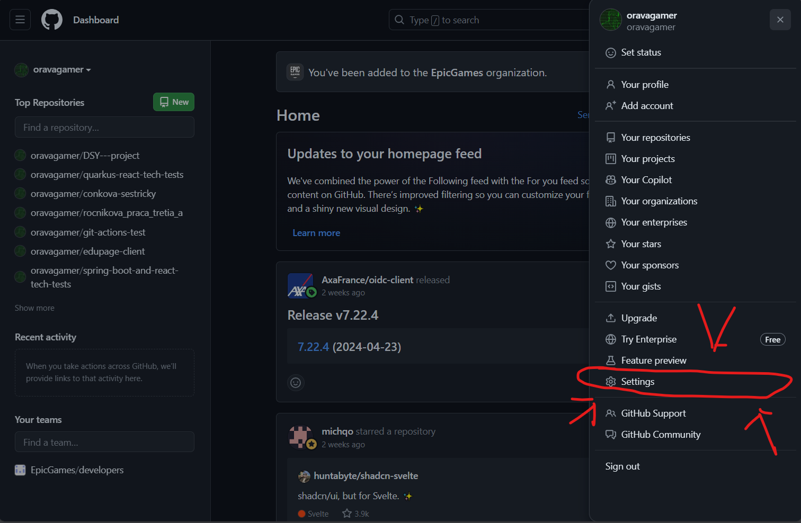
6. Go to `SSH and GPG keys` inside `settings` 
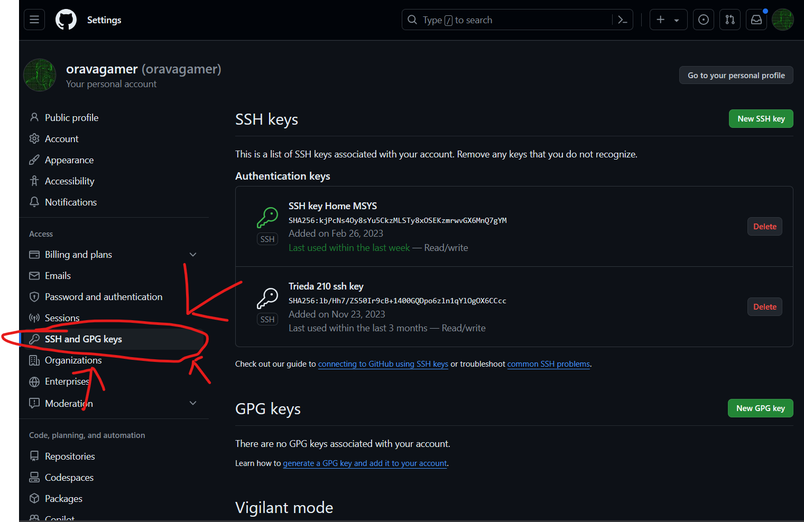
7. Add new SSH key 
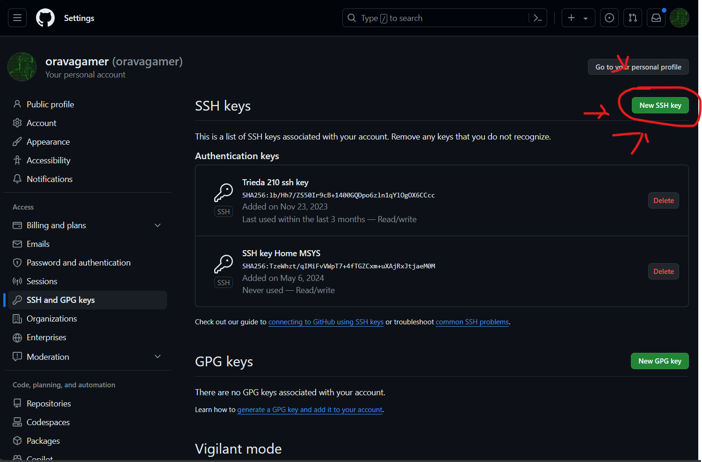
8. Run Msys and enter command to install git
```bash
pacman -S git 
```
9. Now generate SSH key
```bash
ssh-keygen
```
Output will be similar to this:
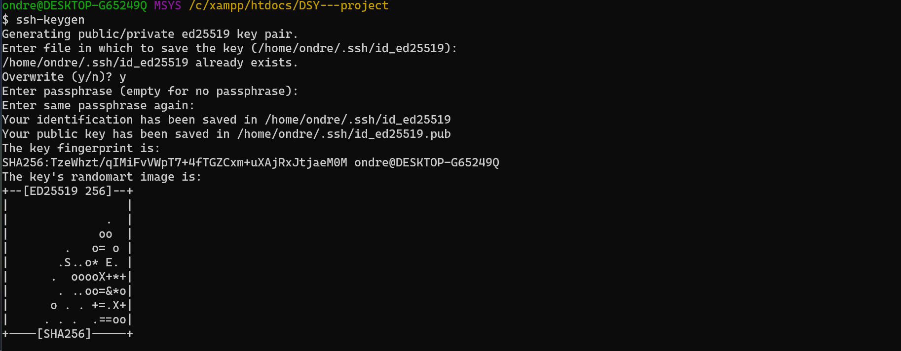
10. Now copy that path to file where public key was saved
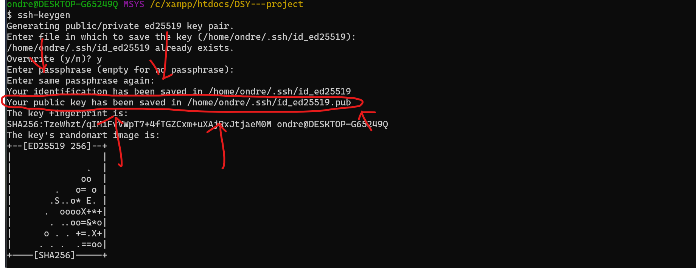
10. Display content of file
```bash
cat <pub-key-file-path>
```
11. Now copy result of this command and paste it into `github` key input and name the key
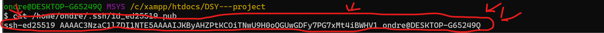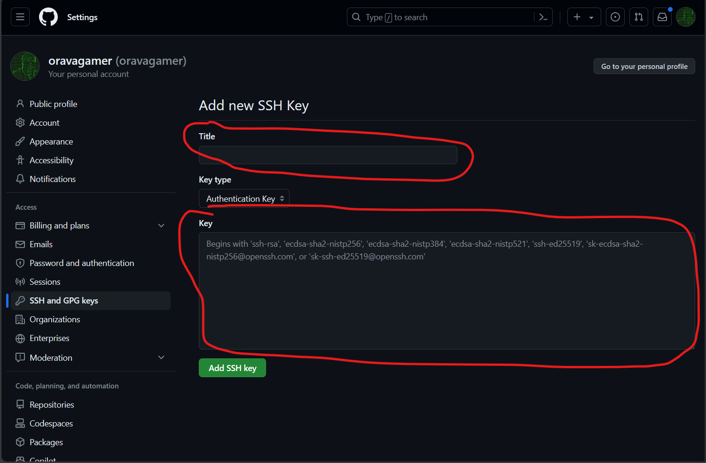
12. Click `add SSH key`
13. Go to Msys and go to path `/c/xampp/htdocs` and clone project
```bash
cd /c/xampp/htdocs
git clone git@github.com:oravagamer/DSY---project.git
```
14. Now you project on your device
15. To setup `DB` copy content of file `structure.sql` inside `C:\xampp\htdocs\DSY---project\rest\api\db` and run it in phpmyadmin
16. Now open `cmd` and go to `C:\xampp\htdocs\DSY---project\frontend` install node dependencies
```bash
npm install
```
17. Now you can start dev server
```bash
npm run dev 
```
18. Now open Insomnia and add new HTTP request
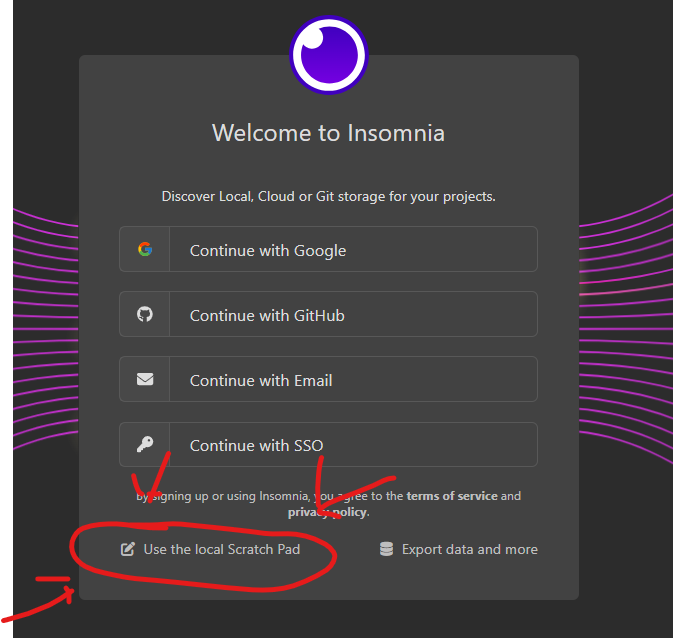
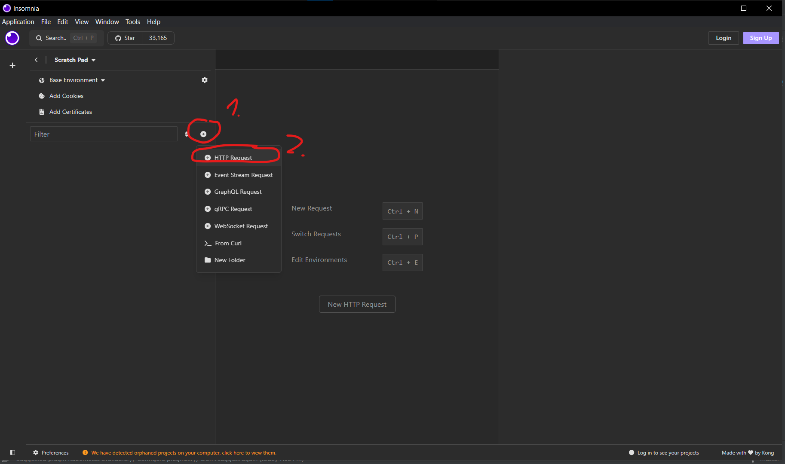
19. Change method from GET to POST
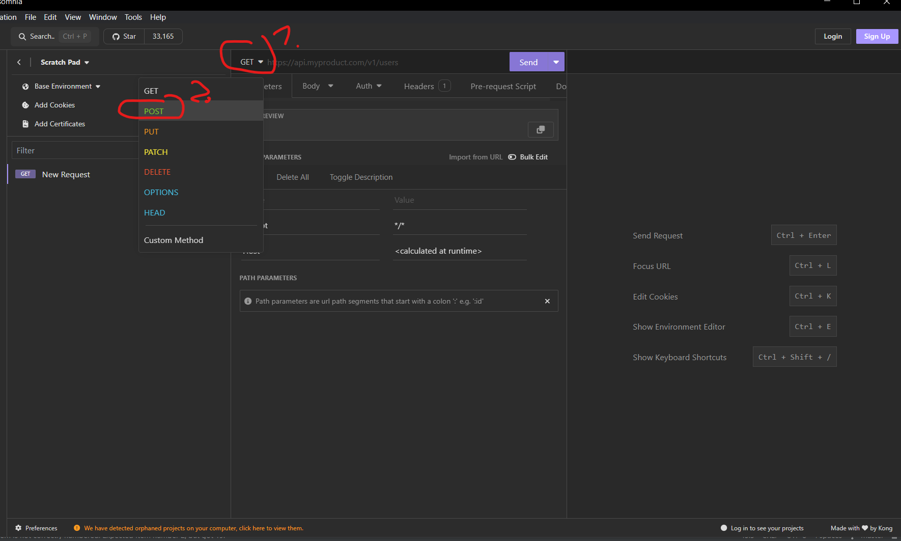
20. Add this url to requested url `http://localhost/DSY---project/rest/api/register.php`
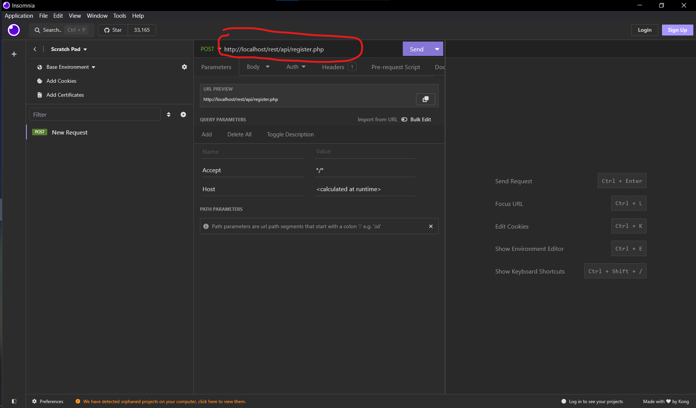
21. Go to body and set body to JSON
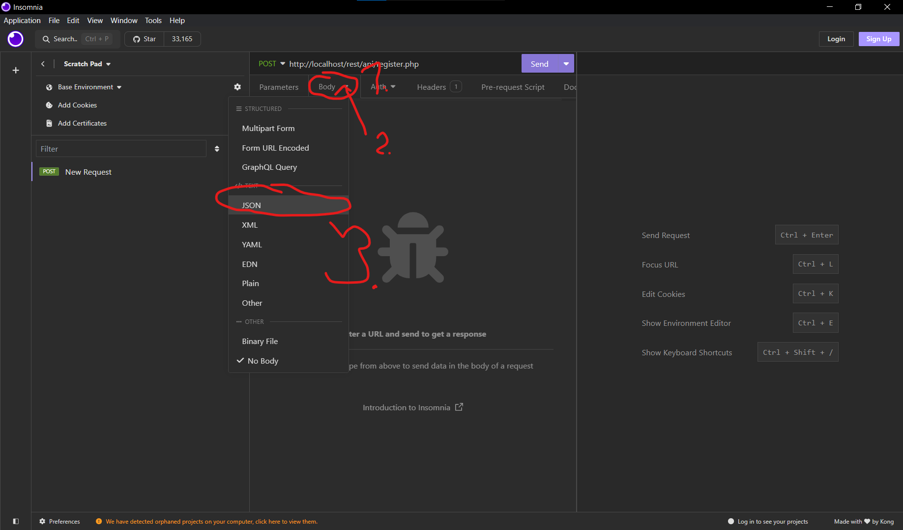
22. Now add this JSON as body
```json
{
	"username": "aaa",
	"password": "aaa",
	"first_name": "aaa",
	"last_name": "aaa",
	"email": "aaa@aaa.aaa"
}
```
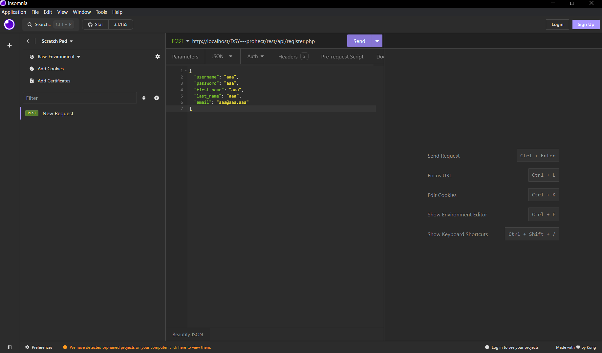
23. Click send
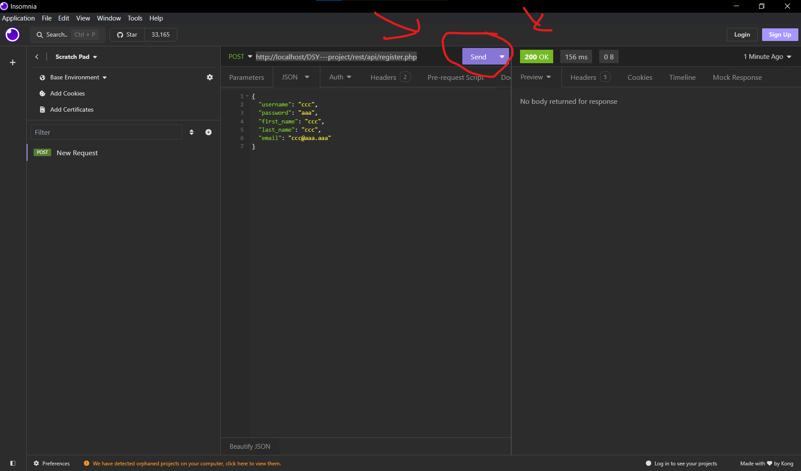
24. Now we have created user with username `aaa` and password `aaa`

## Generate pk and certificate
```bash
.\openssl.exe genpkey -algorithm RSA -out private.key -aes256

set OPENSSL_CONF=C:\xampp\apache\conf\openssl.cnf

.\openssl.exe req -new -key private.key -out request.csr
```